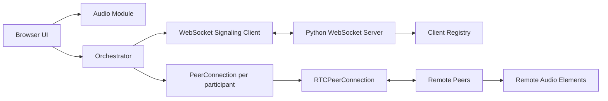

# MCETC Real-Time Voice Connect

[](https://developer.mozilla.org/docs/Web/JavaScript)
[](https://www.python.org/)
[](https://developer.mozilla.org/docs/Web/API/WebRTC_API)
[](https://developer.mozilla.org/docs/Web/API/WebSocket)

> A modular browser-based voice calling platform built with vanilla JavaScript, WebRTC, and a lightweight Python WebSocket signaling server.

## Overview

MCETC Real-Time Voice Connect is a browser-first audio communication project designed for real-time peer-to-peer voice calls. The application captures microphone input in the browser, negotiates WebRTC connections between participants, and uses a Python WebSocket server only as a signaling layer to exchange offers, answers, ICE candidates, and presence events.

The system is intentionally lightweight and framework-free. That makes it easy to understand, easy to debug, and straightforward to extend into a more complete communication product. In its current form, it represents the kind of architecture a small company or internal team could use as the foundation for a low-latency voice collaboration tool, customer support room, or private audio session platform.

## Features

- Real-time browser audio calls with WebRTC.
- Microphone capture handled directly in the browser via `getUserMedia()`.
- Peer-to-peer media transport so audio does not pass through the signaling server.
- WebSocket-based signaling for offers, answers, ICE candidates, and room presence updates, **routed to the specific recipient peer** rather than broadcast to the whole room.
- **Perfect negotiation** per peer connection (`polite` / `makingOffer` state) so that two participants offering audio to each other at the same time no longer collide.
- Multi-peer connection management using a dedicated `PeerConnection` instance per participant.
- Automatic peer creation when a new participant joins the room.
- Dynamic audio rendering in the DOM for remote participants, with automatic cleanup of both the audio element and the on-screen name when a participant leaves or drops.
- STUN-based connectivity support to help peers establish direct routes across networks.
- Modular code separation between audio, UI, connection, peer-connection, and signaling responsibilities.
- Lightweight frontend with no framework dependency or build step.
- Python backend that tracks connected clients and relays signaling messages to the correct recipient.
- Simple button-driven flow to start and end a call, including a clean disconnect/reconnect cycle (the WebSocket is properly closed, not just abandoned).

## Tech Stack

- HTML5 for the application shell.
- CSS3 for layout and visual styling.
- Vanilla JavaScript using ES modules.
- WebRTC for peer-to-peer audio transport.
- WebSocket API for signaling coordination.
- Python 3 for the backend signaling server.
- `websockets` Python package for the async WebSocket server.
- Native browser media APIs such as `navigator.mediaDevices.getUserMedia()` and `RTCPeerConnection`.
- STUN servers from public providers to assist NAT traversal.

## Folder Structure

```text
/
├── index.html
├── main.js
├── style.css
├── audio/
│   └── audio.js
├── connections/
│   └── connection.js
├── peerconnection/
│   └── peerconnection.js
├── signaling/
│   └── signaling.js
├── ui/
│   └── ui.js
└── server/
    ├── main.py
    ├── manejo_de_clientes/
    │   └── worker.py
    └── websocket/
        └── worker.py
```

- `index.html` contains the entry UI and loads the JavaScript module bundle.
- `main.js` holds `Orchestrator`, which coordinates audio capture, WebRTC, signaling, and DOM updates, and routes each incoming signaling message to the right handler.
- `style.css` defines the visual appearance of the current interface.
- `audio/` contains microphone permission handling, track attachment, and remote audio reception.
- `connections/` contains the low-level `RTCPeerConnection` helpers: creating a connection, generating offers/answers, setting local/remote descriptions.
- `peerconnection/` contains `PeerConnection`, one instance per participant — it owns that participant's `RTCPeerConnection`, its pending ICE candidates, and its perfect-negotiation state, and borrows `Connections`/`Signaling`/`Audio` instead of creating its own.
- `signaling/` contains the WebSocket client used to communicate with the signaling server.
- `ui/` contains DOM helpers and button state management.
- `server/` contains the Python WebSocket backend and its support modules for client tracking and message relaying.

## Dynamic Project Architecture

The application is organized around a central orchestration flow in `main.js`.



### How it works

1. The user presses the start button in the browser.
2. The app requests microphone permissions and stores the local media stream.
3. A WebSocket connection is opened to the signaling server.
4. The server assigns a client ID and sends the current room state back to the new participant.
5. The client creates one `PeerConnection` per remote participant, which in turn creates its own `RTCPeerConnection`.
6. The app adds local audio tracks to each peer connection.
7. The browser exchanges `offer`, `answer`, and `ice` messages through the signaling server — each one addressed to a specific recipient, not broadcast.
8. If both sides happen to offer audio at the same moment, perfect negotiation resolves the collision instead of failing.
9. Once ICE negotiation succeeds, audio flows directly between browsers.
10. Remote streams are rendered dynamically as `<audio>` elements in the page, and removed automatically when that participant leaves.

### Data flow

- `Audio` manages the local microphone stream and attaches tracks to each peer connection.
- `Connections` builds and configures `RTCPeerConnection` instances, including SDP and ICE handling — it has no memory of any specific peer.
- `PeerConnection` is the per-participant object: it holds one participant's `RTCPeerConnection`, id, pending ICE candidates and negotiation state, and calls into `Connections`/`Signaling`/`Audio` to do the actual work.
- `Signaling` serializes messages through WebSocket and listens for signaling events.
- `UI` isolates button handling and DOM rendering responsibilities.
- `Orchestrator` coordinates the full lifecycle, keeps `connectionsList` (a `Map` of id → `PeerConnection`) in sync with the room, and dispatches each incoming message type through a handler map instead of a long `switch`.

### Adding new peers

When a new participant joins, the backend notifies existing clients with a `join_notification`. Each active browser then creates a dedicated `PeerConnection` for the newcomer, adds local audio tracks, prepares remote track handling, generates an offer, and sends it through the signaling channel — addressed to that one participant.

### Reusing the template logic

The architecture is already modular enough to scale in the following directions:

- more call controls such as mute, unmute, and device switching,
- additional room state handling,
- participant metadata and avatars,
- recording or transcription layers,
- persistent call history,
- or a full admin dashboard around the signaling backend.

## Installation and Setup

### Prerequisites

- A modern browser with WebRTC support.
- Python 3.10+ recommended.
- The `websockets` package installed in your Python environment.
- VS Code Live Server or any local HTTP server for the frontend.

### Backend setup

1. Open a terminal in the project root.
2. Create and activate a virtual environment if you do not already have one.
3. Install the Python dependency:

```bash
pip install websockets
```

4. Start the signaling server:

```bash
python server/main.py
```

The backend listens on `localhost:8765`.

### Frontend setup

1. Serve the project with a local HTTP server such as Live Server.
2. Open `index.html` through that server, not directly with `file://`.
3. If you are running everything locally, update the WebSocket URL in `signaling/signaling.js` so it points to your local signaling server instead of the hosted tunnel currently defined in the code.

### Recommended local workflow

1. Start the Python signaling server.
2. Launch the frontend through Live Server.
3. Open the page in two (or more) browser tabs or devices.
4. Grant microphone permissions.
5. Press the start button on each client and verify that audio is exchanged peer to peer.

## Responsive Design

The current UI is intentionally minimal, but the project is structured to work across desktop, tablet, and mobile browsers. The layout uses standard HTML, a viewport meta tag, and simple CSS grid placement, which keeps the interface functional across common screen sizes.

For production use, the layout should be expanded with dedicated breakpoints, stronger spacing rules, and a more complete mobile call experience.

## Performance and Optimization

- Audio travels directly between peers once WebRTC negotiation is complete.
- The signaling server only exchanges control messages, and now routes them to the intended recipient instead of broadcasting to every connected client — less noise, fewer chances of a message being misapplied to the wrong connection.
- The codebase is split into small modules, making the runtime easier to reason about and the app easier to maintain.
- STUN servers are used to improve connectivity across NATs and less friendly network environments.
- The frontend is dependency-light, which keeps the payload small and the boot process fast.

## What's New in v1.0.4

- Extracted `PeerConnection`: the offer/track/answer logic that used to be duplicated across three message-handling branches now lives in one class, one instance per participant.
- Replaced the message-handling `switch` with a handler map (`{ offer: this.onOffer, ... }`) on `Orchestrator` — each message type is its own small, testable method.
- Added perfect negotiation (`polite` / `makingOffer` per `PeerConnection`) to resolve the case where two participants offer audio to each other simultaneously — previously this produced an `InvalidStateError` and a failed connection.
- Signaling messages for `offer`/`answer`/`ice` now carry a `to_client_id`, and the server routes them only to that recipient instead of broadcasting to the whole room — with three or more participants, the broadcast approach could apply a message meant for one pair to an unrelated connection.
- Fixed disconnect/reconnect: the client now actually closes the WebSocket on hangup instead of leaving it open and opening a second one on rejoin; the server's exit notification now correctly names the participant who left (it previously misidentified them due to a variable name collision) and reaches the other participants (it previously crashed trying to serialize a socket object).
- A departed participant's name and audio element are now removed from everyone else's screen, and the DOM containers used for that cleanup are cleared without accidentally destroying the placeholder elements needed for future joins.
- Renamed the frontend classes and folders to consistent, short English names (`conections/conection.js` → `connections/connection.js`, `segnaling/` → `signaling/`, etc.) — this README already reflects the current names.

## Future Improvements

- Replace the hardcoded signaling URL with environment-based configuration.
- Add mute/unmute controls for microphone and call audio.
- Improve the visual design with a more premium production UI.
- Introduce room management and multiple call channels.
- Add retry and reconnection logic for transient network failures beyond the manual "leave/rejoin" flow.
- Persist participant metadata and room state on the backend.
- Add call quality telemetry and clearer RTC diagnostics.
- Implement lazy loading for any future media or UI-heavy assets.
- Add an admin or monitoring dashboard for server-side visibility.
- Migrate `sendMessage`/`send_message`'s growing list of optional positional parameters to a single options object, so adding a new field doesn't require touching the signature and every call site.

## Credits

- Built with native browser APIs: WebRTC, WebSocket, and Media Capture.
- Python backend communication powered by the `websockets` library.
- Connectivity supported by public STUN infrastructure from Google, Mozilla, Twilio, Sipgate, and Nextcloud as configured in the client.
- The project structure follows a modular, framework-free frontend pattern that keeps responsibilities separated and easy to extend.

## Notes

- The frontend is not bundled by a build tool; it is designed to run as a static module-based app.
- The current UI is a functional prototype, so the README describes the architecture and production direction rather than overstating finished polish.
